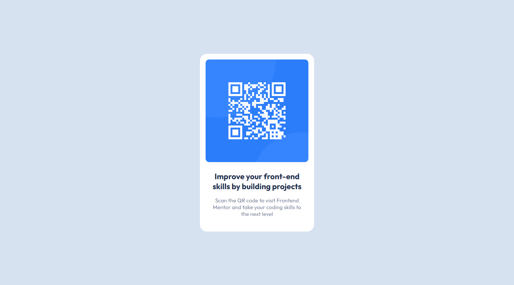

# Frontend Mentor - QR code component

This is a solution to the [QR code component](https://www.frontendmentor.io/challenges/qr-code-component-iux_sIO_H/hub) 🎉

Don't hesitate to comment my code to improve my coding skils 🚀

## Table of contents

- [Overview](#overview)
  - [The challenge](#the-challenge)
  - [Result](#result)
  - [Links](#links)
- [My process](#my-process)
  - [Built with](#built-with)
- [Author](#author)

## Overview

### The challenge

Your challenge is to build out this QR code component and get it looking as close to the design as possible.

### Result

### Links

- Solution URL: [See source code](https://github.com/ClemFRontend/qr-code-component)
- Live Site URL: [qr-code-component-kappa-livid.vercel.app](https://qr-code-component-kappa-livid.vercel.app)

## My process

### Built with

- ⚛️ [React](https://reactjs.org/) - JS library

## Author

- Frontend Mentor - [@ClemFRontend](https://www.frontendmentor.io/profile/ClemFRontend)